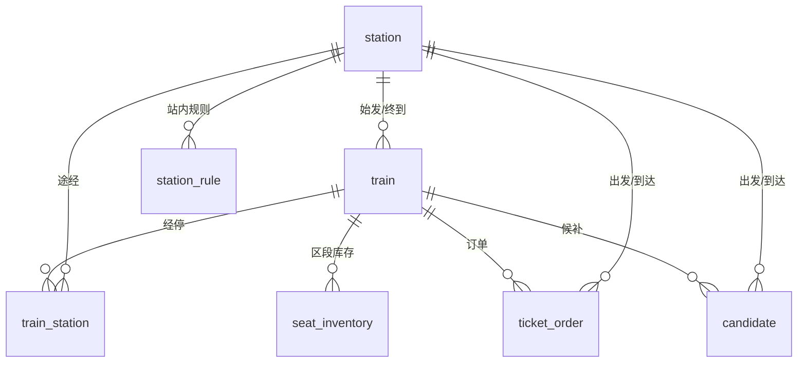

# 数据库设计文档

> 项目：铁路智慧出行综合服务平台
> 版本：v1.0（第2章）　数据库：MySQL 8.4　引擎：InnoDB　字符集：utf8mb4
> 初始化脚本：`sql/init.sql`（可直接导入，含样例数据与查询示例）

---

## 1. 设计总览

### 1.1 七张核心表

| # | 表名 | 中文名 | 主要职责 |
| --- | --- | --- | --- |
| 1 | `station` | 车站表 | 车站基础信息、所属路局、所属站段 |
| 2 | `train` | 车次表 | 车次、等级、上下行、担当路局 |
| 3 | `train_station` | 经停表 | 站序、到发时刻、里程，席位复用与换乘的基石 |
| 4 | `seat_inventory` | 座位库存表 | 原子区段库存，支持席位复用 |
| 5 | `ticket_order` | 订单表 | 下单、支付、超时释放 |
| 6 | `candidate` | 候补表 | 候补登记，供聚合分析与加开建议 |
| 7 | `station_rule` | 站内规则表 | 检票口、走行路线推荐（广州南站） |

### 1.2 ER 关系



### 1.3 命名与类型规范

| 规范 | 说明 |
| --- | --- |
| 表名 | 小写下划线；`order` 是 MySQL 保留字，订单表落地为 `ticket_order` |
| 主键 | `BIGINT UNSIGNED AUTO_INCREMENT`，为千万级订单留空间 |
| 金额 | 一律 `DECIMAL(10,2)`，禁止用 FLOAT/DOUBLE |
| 时刻 | 展示用 `TIME`，跨天用 `day_offset` 标记（如 K599 凌晨到达） |
| 状态 | 枚举用 `ENUM`，含义写入列注释，避免魔法数字 |
| 敏感信息 | 证件号加密存储、查询脱敏（如 `110101********1234`） |

---

## 2. 重点：席位复用的存储逻辑

### 2.1 问题定义

高铁座位在 A—B—C—D 行程中，卖出 A—B 段后，B—C、C—D 仍可售卖。余票不是"总座位数 − 已售张数"，而是每个区段各自计算。

### 2.2 我们的方案：原子区段库存

`seat_inventory` 每一行代表**相邻两站之间**（如站序 1→2、2→3）的库存：

| train_id | travel_date | seat_type | from_station_order | to_station_order | total_count | remaining_count | price |
| --- | --- | --- | --- | --- | --- | --- | --- |
| 1 | 2026-04-15 | 二等座 | 1 | 2 | 500 | 320 | 232.50 |
| 1 | 2026-04-15 | 二等座 | 2 | 3 | 500 | 3 | 344.50 |
| 1 | 2026-04-15 | 二等座 | 3 | 4 | 500 | 210 | 139.50 |

- **区段起点站序 / 终点站序**：锁定这段库存属于哪两个相邻站之间。G1 停 4 站，就有 3 个原子区段；
- **查询北京南(1) → 上海虹桥(4)**：`MIN(remaining_count)` 取 3 个区段的最小值 → **3 张余票**（瓶颈在济南西→南京南）；
- **购票扣减**：区间内 3 个区段同时 `remaining_count - 1`，保证一节车厢的座位在不同区段之间有借有还。

### 2.3 为什么这样设计

| 方案 | 说明 | 结论 |
| --- | --- | --- |
| 整趟车一个库存（错误） | 卖出 A—B 后 B—C 也不可卖 | 不支持复用，运力浪费 |
| 每个 O-D 组合一行 | 4 站产生 6 个 O-D 对，N 站产生 N(N-1)/2 行 | 行数随站数平方增长，写放大严重 |
| **原子区段一行（本方案）** | 4 站只有 3 行，查询取 MIN，扣减批量更新 | 行数线性、语义清晰，12306 同款思路 |

### 2.4 关键 SQL

查询余票（实测返回 3）：

```sql
SELECT MIN(remaining_count) AS remaining
FROM seat_inventory
WHERE train_id = 1
  AND travel_date = '2026-04-15'
  AND seat_type = '二等座'
  AND from_station_order >= 1
  AND to_station_order <= 4;
```

扣减库存（事务内，先锁后扣，余票不足不更新）：

```sql
START TRANSACTION;
SELECT remaining_count FROM seat_inventory
WHERE train_id = 1 AND travel_date = '2026-04-15' AND seat_type = '二等座'
  AND from_station_order >= 1 AND to_station_order <= 4
FOR UPDATE;

UPDATE seat_inventory
SET remaining_count = remaining_count - 1, version = version + 1
WHERE train_id = 1 AND travel_date = '2026-04-15' AND seat_type = '二等座'
  AND from_station_order >= 1 AND to_station_order <= 4
  AND remaining_count >= 1;
COMMIT;
```

`version` 字段用于后续章节的乐观锁；`remaining_count >= 1` 是数据库层的最后一道防超卖兜底。

---

## 3. 索引设计与 EXPLAIN 实测

> 以下输出均为本机 MySQL 8.4.0 真实执行结果，样例数据：station 13 行、train 9 行、train_station 33 行、seat_inventory 947 行、candidate 3025 行。

### 3.1 各表索引一览

| 表 | 索引 | 类型 | 设计理由 |
| --- | --- | --- | --- |
| station | `uk_station_code` / `uk_station_name` / `idx_bureau` | 唯一/普通 | 电报码、站名天然唯一；按路局筛车站 |
| train | `uk_train_no`、`idx_route(start,end)`、`idx_train_type` | 唯一/普通 | 按车次查、按始发终到查、按等级筛 |
| train_station | `uk_train_order(train_id,station_order)`、`idx_station` | 唯一/普通 | 车次内站序唯一；反向按站查经停车次 |
| seat_inventory | `uk_segment(train_id,travel_date,seat_type,from_station_order,to_station_order)` | 唯一 | 覆盖余票查询全部条件，兼作查询索引 |
| ticket_order | `uk_order_no`、`idx_user_created`、`idx_train_date`、`idx_status_expire` | 唯一/普通 | 订单号查询、我的订单、按车查单、超时释放扫描 |
| candidate | `uk_candidate_no`、`idx_agg(travel_date,from,to,status)`、`idx_train_date`、`idx_user` | 唯一/普通 | 候补聚合主索引、按车查、按用户查 |
| station_rule | `idx_station_train(station_id,train_no)` | 普通 | 站内规则按站+车次命中 |

> 隐式索引：InnoDB 会为外键列自动建索引（若没有以该列开头的索引），包括 `train.end_station_id`、`ticket_order.from_station_id`/`to_station_id`、`candidate.from_station_id`/`to_station_id` 共 5 个，EXPLAIN 的 `possible_keys` 里会以 `fk_*` 名称出现。

### 3.2 场景一：无索引 → 全表扫描（候补聚合）

> 复现说明：`sql/init.sql` 建表时已创建 `idx_agg`，要复现本节“无索引”状态，请先执行 `DROP INDEX idx_agg ON candidate;`，跑完 3.2 的 EXPLAIN 后按 3.3 重建。

查询：按日期聚合某日候补，统计各 OD 候补量（`idx_agg` 尚未创建时）：

```sql
EXPLAIN
SELECT c.travel_date, fs.station_name AS from_station, ts.station_name AS to_station,
       c.seat_type, COUNT(*) AS candidate_count
FROM candidate c
         JOIN station fs ON fs.id = c.from_station_id
         JOIN station ts ON ts.id = c.to_station_id
WHERE c.status = 'WAITING' AND c.travel_date = '2026-04-15'
GROUP BY c.travel_date, fs.station_name, ts.station_name, c.seat_type
HAVING COUNT(*) >= 3
ORDER BY candidate_count DESC;
```

实测（无 `idx_agg`）：

```text
+----+-------------+-------+------+-------------------------+------+---------+------+------+----------+----------------------------------------------+
| id | select_type | table | type | possible_keys           | key  | key_len | ref  | rows | filtered | Extra                                        |
+----+-------------+-------+------+-------------------------+------+---------+------+------+----------+----------------------------------------------+
|  1 | SIMPLE      | c     | ALL  | fk_cand_from,fk_cand_to | NULL | NULL    | NULL | 3001 |     2.50 | Using where; Using temporary; Using filesort |
|  1 | SIMPLE      | fs    | eq_ref | PRIMARY               | PRIMARY | 8    | ...  |    1 |   100.00 | NULL                                         |
|  1 | SIMPLE      | ts    | eq_ref | PRIMARY               | PRIMARY | 8    | ...  |    1 |   100.00 | NULL                                         |
+----+-------------+-------+------+-------------------------+------+---------+------+------+----------+----------------------------------------------+
```

**解读**：`type=ALL` 全表扫描；`Using temporary` 说明分组用了临时表；`Using filesort` 说明排序无法用索引。3000 行尚可，百万行候补数据就会拖垮系统。

### 3.3 场景二：加上联合索引 → ref + 索引条件下推

```sql
-- 先移除 init.sql 建表时已创建的索引，再手动重建，复现优化过程
DROP INDEX idx_agg ON candidate;
ALTER TABLE candidate ADD INDEX idx_agg (travel_date, from_station_id, to_station_id, status);
```

实测（同一查询）：

```text
+----+-------------+-------+------+---------------------------------+---------+---------+-------+------+----------+--------------------------------------------------------+
| id | select_type | table | type | possible_keys                   | key     | key_len | ref   | rows | filtered | Extra                                                  |
+----+-------------+-------+------+---------------------------------+---------+---------+-------+------+----------+--------------------------------------------------------+
|  1 | SIMPLE      | c     | ref  | fk_cand_from,fk_cand_to,idx_agg | idx_agg | 3       | const | 1018 |    25.00 | Using index condition; Using temporary; Using filesort |
|  1 | SIMPLE      | fs    | eq_ref | PRIMARY                       | PRIMARY | 8       | ...   |    1 |   100.00 | NULL                                                   |
|  1 | SIMPLE      | ts    | eq_ref | PRIMARY                       | PRIMARY | 8       | ...   |    1 |   100.00 | NULL                                                   |
+----+-------------+-------+------+---------------------------------+---------+---------+-------+------+----------+--------------------------------------------------------+
```

**解读**：`type=ref`，命中 `idx_agg`；`rows` 从 3001 降到 1018（仅扫描该日数据）；`Using index condition` 表示 `status` 条件下推到索引层过滤。

### 3.4 场景三：覆盖索引（Using index）

四条件等值查询，`COUNT(*)` 所需数据全在索引里，无需回表：

```sql
EXPLAIN SELECT COUNT(*) FROM candidate
WHERE travel_date = '2026-04-15' AND from_station_id = 8 AND to_station_id = 12 AND status = 'WAITING';
```

实测：

```text
+------------+------+---------------------------------+---------+---------+-------------------------+------+----------+--------------------------+
| table      | type | possible_keys                   | key     | key_len | ref                     | rows | filtered | Extra                    |
+------------+------+---------------------------------+---------+---------+-------------------------+------+----------+--------------------------+
| candidate  | ref  | fk_cand_from,fk_cand_to,idx_agg | idx_agg | 20      | const,const,const,const |  158 |   100.00 | Using where; Using index |
+------------+------+---------------------------------+---------+---------+-------------------------+------+----------+--------------------------+
```

**解读**：`key_len=20` = travel_date(3) + from_station_id(8) + to_station_id(8) + status(1)，四列全部命中；`Using index` 即覆盖索引，只读索引不回表。

### 3.5 场景四：回表 vs 覆盖索引

同样条件的查询，`SELECT candidate_no` 需要回表取数据：

```sql
EXPLAIN SELECT candidate_no FROM candidate
WHERE travel_date = '2026-04-15' AND from_station_id = 8 AND to_station_id = 12 AND status = 'WAITING';
```

实测：

```text
+------------+------+---------------------------------+---------+---------+-------------------------+------+----------+-----------------------+
| table      | type | possible_keys                   | key     | key_len | ref                     | rows | filtered | Extra                 |
+------------+------+---------------------------------+---------+---------+-------------------------+------+----------+-----------------------+
| candidate  | ref  | fk_cand_from,fk_cand_to,idx_agg | idx_agg | 20      | const,const,const,const |  158 |   100.00 | Using index condition |
+------------+------+---------------------------------+---------+---------+-------------------------+------+----------+-----------------------+
```

**解读**：Extra 中没有 `Using index`，说明要走二级索引 → 主键 → 聚簇索引取 `candidate_no`，也就是"回表"。

### 3.6 场景五：最左前缀与索引失效（真实行为）

**（1）缺少最左列**：`idx_agg` 第一列是 `travel_date`，下面的查询用不上它：

```sql
EXPLAIN SELECT COUNT(*) FROM candidate WHERE from_station_id = 8 AND to_station_id = 12;
```

实测：

```text
| candidate | index_merge | fk_cand_from,fk_cand_to,idx_agg | fk_cand_to,fk_cand_from | ... | Using intersect(fk_cand_to,fk_cand_from); Using where; Using index |
```

优化器只能退而求其次做索引合并，没有走 `idx_agg`。条件中带上 `travel_date` 后即可命中（见场景三）。

**（2）函数包住索引列**：

```sql
EXPLAIN SELECT * FROM candidate WHERE DATE(candidate_time) = '2026-04-15';
```

实测：

```text
| candidate | ALL | NULL | NULL | NULL | 3001 | 100.00 | Using where |
```

`candidate_time` 没有索引，`DATE()` 又让任何该列索引都无法使用。应改写为范围查询：

```sql
WHERE candidate_time >= '2026-04-15 00:00:00' AND candidate_time < '2026-04-16 00:00:00'
```

**（3）前导模糊 LIKE**：

```sql
EXPLAIN SELECT * FROM station WHERE station_name LIKE '%南';
```

实测：

```text
| station | ALL | NULL | NULL | NULL | 13 | 11.11 | Using where |
```

`station_name` 有唯一索引，但 `%南` 无法利用 B+ 树有序性。前导确定（`LIKE '北京%'`）才能走范围扫描。

### 3.7 场景六：余票查询命中联合索引

```sql
EXPLAIN SELECT MIN(remaining_count) FROM seat_inventory
WHERE train_id = 1 AND travel_date = '2026-04-15' AND seat_type = '二等座'
  AND from_station_order >= 1 AND to_station_order <= 4;
```

实测：

```text
+----------------+-------+---------------+------------+---------+------+------+----------+-----------------------+
| table          | type  | possible_keys | key        | key_len | ref  | rows | filtered | Extra                 |
+----------------+-------+---------------+------------+---------+------+------+----------+-----------------------+
| seat_inventory | range | uk_segment    | uk_segment | 97      | NULL |    3 |    33.33 | Using index condition |
+----------------+-------+---------------+------------+---------+------+------+----------+-----------------------+
```

**解读**：`uk_segment = (train_id, travel_date, seat_type, from_station_order, to_station_order)`，前三列等值 + `from_station_order` 范围，`key_len=97`（8+3+82+4），只扫 3 行。

### 3.8 为什么"加了索引偶尔仍是全表扫描"

把场景二的日期条件去掉、聚合全部 3 天数据时，优化器依然选择 `type=ALL`——即使 `idx_agg` 已存在。原因：

1. 查询需要读取全表所有行（无有效过滤列在索引最左）；
2. 3000 行的小表只占几个数据页，全表扫描比"二级索引逐行回表"更便宜；
3. 优化器是基于**成本**而非"有没有索引"决策。

结论：索引不是越多越好，EXPLAIN 要看 `type/key/rows/Extra` 四项综合判断，而不是"命中索引就万事大吉"。

---

## 4. 事务与一致性设计

### 4.1 下单与库存

- 下单在**一个事务**内完成：锁库存区段（`FOR UPDATE`）→ 校验余票 → 扣减 → 写订单；
- 所有区段扣减与订单写入要么全部成功，要么全部回滚（ACID 的原子性）；
- 支付超时由 `idx_status_expire(status, expire_at)` 支撑定时任务扫描并释放库存；
- `version` 字段预留乐观锁方案，第4章会在 Redis 分布式锁与数据库乐观锁之间做取舍。

### 4.2 隔离级别选择

MySQL 默认 **REPEATABLE READ（可重复读）**。本项目沿用默认级别：

- 余票查询用快照读（MVCC），不加锁、并发高；
- 扣减库存用当前读（`FOR UPDATE` / `UPDATE`），配合 Next-Key Lock 防止区间幻读；
- 详细原理（MVCC、ReadView、间隙锁、死锁排查）见 `docs/chapters/chapter-02.md`。

---

## 5. 高频查询 SQL

### 5.1 余票查询（按区段取最小）

```sql
SELECT MIN(remaining_count) AS remaining
FROM seat_inventory
WHERE train_id = ? AND travel_date = ? AND seat_type = ?
  AND from_station_order >= ? AND to_station_order <= ?;
```

### 5.2 候补聚合（按出发站、到达站、日期分组）

```sql
SELECT c.travel_date,
       fs.station_name AS from_station,
       ts.station_name AS to_station,
       c.seat_type,
       COUNT(*)        AS candidate_count,
       MIN(c.candidate_time) AS first_candidate_time
FROM candidate c
         JOIN station fs ON fs.id = c.from_station_id
         JOIN station ts ON ts.id = c.to_station_id
WHERE c.status = 'WAITING'
  AND c.travel_date BETWEEN ? AND ?
GROUP BY c.travel_date, fs.station_name, ts.station_name, c.seat_type
HAVING COUNT(*) >= 3
ORDER BY candidate_count DESC, c.travel_date;
```

实测聚合结果（节选）：

```text
+------------+------------+------------+--------+-----------------+---------------------+
| travel_date | from_station | to_station | seat_type | candidate_count | first_candidate_time |
+------------+------------+------------+--------+-----------------+---------------------+
| 2026-04-15 | 广州南     | 武汉       | 二等座 |             157 | 2026-04-01 08:24:00 |
| 2026-04-16 | 广州南     | 武汉       | 二等座 |             155 | 2026-04-01 08:04:00 |
| 2026-04-15 | 北京南     | 上海虹桥   | 二等座 |             154 | 2026-04-01 08:06:00 |
| 2026-04-15 | 广州南     | 深圳北     | 二等座 |             153 | 2026-04-01 09:20:00 |
+------------+------------+------------+--------+-----------------+---------------------+
```

该结果就是第6章"候补驱动动态加开建议"的数据输入：同一 OD 候补积压越高，加开优先级越高。接口层每次分析单个乘车日期，`CandidateMapper.xml` 用 `travel_date = #{travelDate}` 等值条件（同样命中 `idx_agg` 最左列），上例的范围写法仅用于一次查看多日数据。

### 5.3 站内规则命中（广州南站示例）

```sql
SELECT recommended_gate, walking_route, walking_minutes
FROM station_rule
WHERE station_id = 8 AND train_no = 'G1101'
ORDER BY priority DESC, walking_minutes ASC
LIMIT 1;
```

---

## 6. 设计取舍记录

| 取舍点 | 选择 | 原因 |
| --- | --- | --- |
| 订单表命名 | `ticket_order` | `order` 是保留字，避免每次写 SQL 都要反引号 |
| 是否用外键 | 保留外键 | 学习阶段保证数据一致性；生产中高并发系统常去掉外键由应用层保障 |
| 库存粒度 | 原子区段 | 行数线性增长，支持复用，查询取 MIN |
| 乐观锁字段 | `version` | 为第4章并发扣减预留，不提前过度设计 |
| 跨天时刻 | `day_offset` | 避免把 K599 这类跨天车次的时刻写成超出 24 小时的怪值 |
| 金额类型 | `DECIMAL(10,2)` | 精确计算，避免浮点误差导致对账问题 |

---

## 7. 如何运行

```bash
mysql -u root -p --default-character-set=utf8mb4 < sql/init.sql
```

脚本会：重建 `railway` 库 → 建 7 张表 → 灌入样例数据（含批量生成的 3000+ 候补、900+ 库存）→ 执行查询示例与 `ANALYZE TABLE`。
