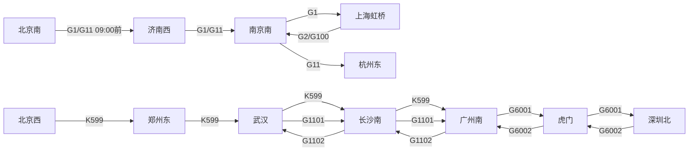

# 算法设计文档：换乘路径规划与站内规则引擎

> 项目：铁路智慧出行综合服务平台
> 版本：v1.0（第5章）　深度：图论 L4 / 规则引擎 L3-L4
> 代码位置：`src/main/java/com/railway/algorithm/`、`src/main/java/com/railway/ruleengine/`
> 验证方式：JUnit5 离线测试（本机未启动服务，未做 HTTP 实测，文末标注）

---

## 1. 总览

第5章解决两个问题：

| 问题 | 算法/设计 | 接口 | 代码入口 |
| --- | --- | --- | --- |
| 无直达车时如何换乘，最快/最经济如何取舍 | 时间扩展图 + Dijkstra/A* | `GET /api/routes/transfer` | `TransferRouteService` → `TimeExpandedGraph` → `DijkstraRoutePlanner` |
| 进站后走哪个检票口、怎么走、走多久 | 策略模式 + 责任链 | `GET /api/station/route-guide` | `StationRouteService` → `StationRuleEngine` → 5 个 `StationRuleHandler` |

调用链：

```text
GET /api/routes/transfer?from=上海虹桥&to=杭州东&strategy=fastest
  └─ TransferController.plan
       └─ TransferRouteService.plan                 ← 参数校验、策略解析、双模式取图
            ├─ TransferGraphProvider.graph(date)     ← memory: 内存样例时刻表 / db: 查 train_station
            ├─ DijkstraRoutePlanner | AStarRoutePlanner
            │     └─ AbstractRoutePlanner.plan       ← 多源 Dijkstra + 策略权重 + 剪枝
            └─ TransferPlanVO                        ← 车次、时刻、换乘站、等待、总耗时、总价

GET /api/station/route-guide?trainNo=G1101&formationLength=16&trackNo=9&entryDirection=北&passengerFloor=2F
  └─ StationRouteController.routeGuide
       └─ StationRouteService.guide                  ← 参数校验与别名归一化
            └─ StationRuleEngine.guide               ← 按 order 执行责任链
                 ├─ TrackZoneRule          (10) 股道 → 检票区
                 ├─ FormationLengthRule    (20) 编组 → 检票口微调与步行增量
                 ├─ EntryDirectionRule     (30) 进站方向 → 进站口/通道
                 ├─ PassengerFloorRule     (40) 楼层 → 扶梯/垂直移动
                 └─ WalkTimeAuditRule      (50) 汇总路线与步行时间
```

---

## 2. 图模型设计

### 2.1 为什么不用"车站图"

如果把每个车站当一个节点、每趟车当一条边，只能回答"能不能到"，回答不了：

- 换乘要等多久、等待是否超过阈值；
- 同一趟车跨天运行（K599 次日到达）怎么算；
- 哪一段区间是"一程"，怎么还原成乘客看得懂的车次列表。

所以本章采用**时间扩展图（Time-Expanded Graph）**：把"时间"显式地展成节点。

### 2.2 节点与边的定义

```text
节点：车站 × 事件时刻
  到达事件 arr(train, station, time)：某车次某站到达
  出发事件 dep(train, station, time)：某车次某站发车

边：
  运行边（ride）  dep(train, A, t1) → arr(train, B, t2)    权重：历时/票价
  换乘边（wait）  arr(trainX, S, t1) → dep(trainY, S, t2)  权重：等待分钟（票价 0）
```

同车次连续区段由**一条直达运行边**覆盖（例如 G1 北京南→上海虹桥是一条边，不是三段），所以图里不会出现"同车换乘"的假换乘。

约束（构建与搜索时生效）：

| 约束 | 默认值 | 配置项 | 作用 |
| --- | --- | --- | --- |
| 最短换乘时间 | 10 分钟 | `railway.route.min-transfer-minutes` | 太短会误判为可行换乘 |
| 最长换乘等待 | 240 分钟 | `railway.route.max-wait-minutes` | 太长会绕路/久等 |
| 最大换乘次数 | 2 | `railway.route.max-transfers` | 防止多段拼凑绕路 |
| 总耗时上限 | 1440 分钟 | `railway.route.max-duration-minutes` | 兜底剪枝 |

### 2.3 样例（本章内存模式数据）

以 `sql/init.sql` 的 9 趟车、13 个车站为数据源，抽取与换乘有关的关键图：



可换乘的典型路径（也作为测试用例）：

```text
上海虹桥 --G2 07:00→08:23--> 南京南 --等待163分-- G11 11:06→12:48--> 杭州东
                                       ↑ 换乘边，权重 163 分钟
北京南 --------------------G1 09:00→13:28--------------------> 上海虹桥（直达，1 条运行边）
```

### 2.4 跨天处理

`train_station.day_offset` 表示相对始发日的天偏移。K599 长沙南到达 00:50 为 `day_offset=1`，转换为"当日绝对分钟"：

```text
absoluteMinute = day_offset × 1440 + hour × 60 + minute
长沙南到达 = 1×1440 + 50 = 1490
广州南到达 = 1×1440 + 310 = 1750
```

换乘边要求 `dep.absoluteMinute - arr.absoluteMinute` 落在 `[minTransfer, maxWait]` 区间，天然处理跨天，不会出现负等待。

---

## 3. Dijkstra 与 A*

### 3.1 统一抽象

`AbstractRoutePlanner` 用模板方法把两种算法统一：

```text
plan(graph, from, to, strategy, options)
  1. 起点：from 站的所有"出发事件"入队，代价 0（多源初始化）
  2. 出队最小代价状态，若为 to 站的"到达事件"则结束
  3. 松弛：运行边 → 按策略累加权重；换乘边 → 换乘次数 +1 且等待计时
  4. 剪枝：换乘次数、总耗时超限直接跳过
  5. 回溯 previous 指针，还原每一程（车次、上下车站、时刻、票价、换乘等待）
```

- **Dijkstra**：启发函数恒为 0（`DijkstraRoutePlanner`），保证最优；
- **A\***：启发函数 `h = 剩余里程 / 350km/h`（`AStarRoutePlanner`），其中剩余里程用"反图 + 里程"预计算，`h ≤ 真实剩余耗时`（真实平均速度不可能超过 350km/h，且未计入等待），因此可采纳且一致，结果与 Dijkstra 一致。最经济策略下 `h=0`，退化为 Dijkstra（票价没有可靠的几何下界）。

### 3.2 两种策略的权重

| 策略 | 主权重 | 并列比较 | 语义 |
| --- | --- | --- | --- |
| `fastest` | 总耗时（运行 + 等待） | 价格 → 换乘次数 | 从首程发车到末程到达最短 |
| `cheapest` | 总票价 | 总耗时 → 换乘次数 | 价格最低，其次选快的 |

注意：`fastest` 最小化的是**总历时**而非"最早到达"。若要实现"从当前时刻出发最早到达"，只需在初始化时过滤掉早于当前时刻的出发事件并改为按到达时刻比较，属于可扩展点。

### 3.3 防绕路

- 换乘次数 ≤ 2；
- 单次等待 ≤ 240 分钟；
- 总耗时 ≤ 24 小时；
- 运行边权重恒正（历时/票价 > 0），不存在负环。

测试用例 `上海虹桥→杭州东` 断言换乘站恰为 `[南京南]`，路径中不得出现北京、广州，防止"上海→北京→苏州"式离谱绕路。

### 3.4 复杂度

设事件节点数 V、边数 E。Dijkstra 用二叉堆：`O((V+E) log V)`；样例数据 V≈40、E≈80，单次查询微秒级。A* 因为启发函数让队列更快收敛到终点，节点扩展数更少；在样例数据上两者结果一致，已由测试断言。

---

## 4. 规则引擎设计

### 4.1 为什么不用一堆 if-else

站内推荐要组合"股道、编组、进站方向、楼层、拥堵"等多个维度，500 条规则如果写成嵌套 if-else：

- 加一条规则要改核心方法，回归测试成本极高；
- 规则之间有优先级，谁覆盖谁说不清；
- 无法按数据驱动（`station_rule` 表）动态加载。

### 4.2 责任链 + 策略

```text
StationRuleEngine（固定骨架：按 order 排序依次执行）
  ├─ TrackZoneRule          order=10  股道 → A/B/C 区、检票口基数、安检通道、基础步行分钟
  ├─ FormationLengthRule    order=20  编组 → 检票口偏移、步行增量、容量收紧提示
  ├─ EntryDirectionRule     order=30  北/南 → 进站口与 C 区专用通道
  ├─ PassengerFloorRule     order=40  2F/1F/3F/B1 → 扶梯/垂直移动与步行增量
  └─ WalkTimeAuditRule      order=50  汇总路线文本、计算最终步行时间（4-18 分钟截断）
```

- **策略模式**：`RouteStrategy`（fastest/cheapest）与规则链的每个 `StationRuleHandler` 都是可替换的算法单元；
- **责任链模式**：`StationRuleHandler.apply(context)` 依次加工同一个 `StationRuleContext`，新增规则只需新增一个 Bean 并声明 `order`，不改引擎与既有规则；
- 扩展为 500 条数据驱动规则时：实现一个 `DbStationRuleHandler`，从 `station_rule` 表按 `station_id + train_no` 精确匹配，命中则短路返回；未命中继续走公式规则。

### 4.3 五条简化规则

| # | 规则 | 输入 | 输出 | 关键逻辑 |
| --- | --- | --- | --- | --- |
| 1 | 股道分区 | 停靠股道 | 检票区、安检通道、基础分钟 | 1-6 → A 区/东安检/4 分；7-11 → B 区/西安检/5 分；12-18 → C 区/东侧通道/7 分；检票口基数 = 股道号 × 2（A/B 上限 16，C 上限 8） |
| 2 | 编组长度 | 编组辆数 | 检票口微调、步行增量 | ≤8 节 → 检票口 -2、+0 分；9-16 节 → +2、+1 分；>16 节 → +4、+2 分 |
| 3 | 进站方向 | 北/南 | 进站口、C 区通道 | 北 → "东侧扶梯下 1F"；南 → "东侧通道"（仅 C 区） |
| 4 | 旅客楼层 | 2F/1F/3F/B1 | 扶梯文案、步行增量 | 1F → 中央扶梯上 2F、+2；3F → 3F 餐饮区、西侧扶梯下 2F、+2；B1 → 地铁层扶梯上 2F、+3 |
| 5 | 步行时间核算 | 汇总上下文 | 路线文本、分钟数 | 拼接"进站口 → 安检 → 扶梯 → 检票口 → 站台"，分钟截断到 [4,18] |

### 4.4 规则执行示例（JUnit 实测值）

输入：`G1101, 16 节, 9 股道, 北, 2F`

```text
1. 股道分区：9 → B 区，检票口基数 min(18,16)=16，安检"西安检区"，基础 5 分
2. 编组长度：16 节 → 检票口 +2 → 18，超额收紧回 B16，步行 +1，记提示
3. 进站方向：北且非 C 区 → 进站口"2F北进站口"，无额外通道
4. 旅客楼层：2F → 无垂直移动
5. 步行核算：5+1 = 6 分；路线 = 2F北进站口→西安检区→B16检票口→9站台
```

输出：

```json
{
  "stationName": "广州南",
  "trainNo": "G1101",
  "zone": "B",
  "recommendedGate": "B16",
  "walkingRoute": "2F北进站口→西安检区→B16检票口→9站台",
  "walkingMinutes": 6,
  "matchedRules": ["股道分区规则", "编组长度规则", "进站方向规则", "旅客楼层规则", "步行时间核算规则"],
  "notes": ["检票口已按股道容量收紧至 B16"]
}
```

与 `sql/init.sql` 中 `station_rule` 样例行（如 G1101 北 2F → B08、7 分钟）存在差异：样例行是**数据驱动版**的目标形态，本章实现的是**公式简化版**，两者架构上可以通过新增 `DbStationRuleHandler` 并存，验收以本章规则公式为准。

---

## 5. 双模式与配置

```yaml
railway:
  route:
    mode: memory            # memory: 内存样例时刻表(离线验证) | db: 查 MySQL
    algorithm: dijkstra     # dijkstra | astar
    min-transfer-minutes: 10
    max-wait-minutes: 240
    max-transfers: 2
    max-duration-minutes: 1440
```

| 模式 | 实现 | 数据来源 | 说明 |
| --- | --- | --- | --- |
| `memory`（默认） | `MemoryTransferGraphProvider` | 与 `sql/init.sql` 一致的 9 趟车时刻表与票价 | 无 MySQL 也能跑通全部测试 |
| `db` | `DbTransferGraphProvider` | `TrainMapper.selectAllStops()` + `selectSegmentPrices()` | 未在本机验证（MySQL 未运行），代码与 SQL 已就绪 |

DB 模式的票价按 `二等座` 优先、`硬座` 兜底；某区段完全无票价时，构建器按 0.45 元/公里估算兜底（会记录为估算值，属于模拟逻辑）。

---

## 6. API 与实测

### 6.1 换乘规划

```bash
curl "http://localhost:8080/api/routes/transfer?from=上海虹桥&to=杭州东&strategy=fastest"
```

JUnit 实测（`TransferRouteServiceTest`）：

| 用例 | 结果 |
| --- | --- |
| 上海虹桥→杭州东 fastest | 2 程：G2 07:00→08:23 + 等待 163 分 + G11 11:06→12:48，总 348 分，360.00 元，换乘站 [南京南] |
| 北京南→上海虹桥 fastest | 1 程 G1 09:00→13:28，268 分，716.50 元 |
| 虎门→深圳北 fastest | 1 程 G6001 08:48→09:02，14 分 |
| 武汉→广州南 fastest | 1 程 G1101 14:00→17:55，235 分 |
| 上海→苏州 | 车站不存在错误码 1001 |
| 郑州东→杭州东 | 无方案错误码 3001 |
| 非法策略 | 参数错误 400 |
| A* 与 Dijkstra | 总耗时/总价/换乘数一致 |

### 6.2 站内路径

```bash
curl "http://localhost:8080/api/station/route-guide?trainNo=G1101&formationLength=16&trackNo=9&entryDirection=北&passengerFloor=2F"
```

JUnit 实测（`StationRuleEngineTest` / `StationRouteServiceTest`）：

| 输入 | 推荐检票口 | 路线 | 步行 |
| --- | --- | --- | --- |
| G1101 16节 9股道 北 2F | B16 | 2F北进站口→西安检区→B16检票口→9站台 | 6 分 |
| G6002 8节 3股道 北 2F | A04 | 2F北进站口→东安检区→A04检票口→3站台 | 4 分 |
| G1101 16节 9股道 南 1F | B16 | 1F南进站口→中央扶梯上2F→B16检票口→9站台 | 8 分 |
| K599 18节 12股道 南 1F | C08 | 1F南进站口→东侧通道→C08检票口→12站台 | 11 分 |
| 自定义规则 order=45 | 不变 | 不变 | 6+2=8 分（验证可扩展） |

### 6.3 验证边界（必须如实标注）

- 本机 8080 端口未启动服务，**未做真实 HTTP 调用**；以上数据来自 JUnit5 离线单测（`.\mvnw.cmd test`，42 个测试全部通过，其中本章新增 30 个）。
- DB 模式未连接 MySQL 实测，代码与 SQL 已写好，切换步骤见第 5 节。
- A* 与 Dijkstra 的一致性在样例图上验证；更大图上建议补充随机图对拍测试。

---

## 7. 代码地图

| 文件 | 职责 |
| --- | --- |
| `algorithm/TimeExpandedGraph.java` | 时间扩展图：事件节点 + 运行边/换乘边构建 |
| `algorithm/AbstractRoutePlanner.java` | 多源 Dijkstra/A* 模板：权重、剪枝、回溯 |
| `algorithm/DijkstraRoutePlanner.java` | Dijkstra（h=0） |
| `algorithm/AStarRoutePlanner.java` | A*（里程/350km/h 启发函数） |
| `algorithm/TransferGraphProvider.java` | 取图接口（双模式） |
| `algorithm/MemoryTransferGraphProvider.java` | 内存样例时刻表与票价 |
| `algorithm/DbTransferGraphProvider.java` | MySQL 装载时刻表与票价 |
| `algorithm/RouteStrategy.java` | fastest/cheapest 策略枚举 |
| `service/TransferRouteService.java` | 校验、策略选择、调算法 |
| `controller/TransferController.java` | `GET /api/routes/transfer` |
| `ruleengine/StationRuleEngine.java` | 规则链执行器 |
| `ruleengine/StationRuleHandler.java` | 规则接口（order + apply） |
| `ruleengine/StationRuleContext.java` | 规则上下文（累积加工结果） |
| `ruleengine/rule/*.java` | 5 条简化规则 |
| `service/StationRouteService.java` | 入参校验与别名归一化 |
| `controller/StationRouteController.java` | `GET /api/station/route-guide` |

---

## 8. 已知取舍与优化方向

| 取舍 | 现状 | 后续优化 |
| --- | --- | --- |
| 换乘只支持同站 | 跨站换乘（北京南↔北京西）不考虑 | 引入同城站点分组与跨站接驳时间 |
| 票价简化 | 内存模式按席别样例价；DB 模式二等座优先 | 接入递远递减定价模型与多席别比价 |
| 启发函数 | 里程/350km/h，依赖里程数据 | 用经纬度大圆距离或历史运行数据训练 |
| K 车跨天 | day_offset 绝对分钟处理 | 支持多日班次与凌晨衔接 |
| 规则数据 | 5 条公式规则 | `DbStationRuleHandler` 接入 `station_rule` 500 条 |
| 到达时间策略 | 最小总历时 | 增加 earliestArrival / latestDeparture 策略 |
