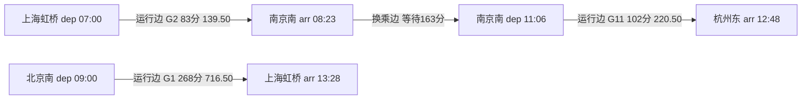

# 第5章 路径规划与规则引擎

> 项目：铁路智慧出行综合服务平台
> 状态：✅ 已完成
> 建议耗时：第7-8周，约5-7天
> 深度：图论与图算法 L4（邻接表、优先队列、Dijkstra、A*、时间扩展图）；规则引擎 L3-L4（策略模式、责任链模式）
> 一句话：把"车站+时间"展开成图，用 Dijkstra/A* 在时间扩展图上找最快或最经济的换乘方案；把广州南站的检票口经验写成责任链规则，输入五项参数就能推荐检票口、走行路线与步行时间。

---

## 本章目标

| 目标 | 具体产出 | 验收方式 |
| --- | --- | --- |
| 图论 L4 | 邻接表、优先队列、手写 Dijkstra、A* 启发函数 | 能画时间扩展图、能手写 Dijkstra 主循环 |
| 时间扩展图 | 节点=车站+时间，边=运行区段+换乘等待 | 能说清跨天 `day_offset` 与换乘阈值 |
| 双策略 | `fastest` / `cheapest`（结合递远递减票价） | 两种策略给出不同取舍 |
| 换乘接口 | `GET /api/routes/transfer` | 无直达车时给出合理换乘，不出现离谱绕路 |
| 规则引擎 | 策略模式 + 责任链，5 条简化规则 | 5 条规则推荐正确，新增规则不改核心代码 |
| 站内接口 | `GET /api/station/route-guide` | 输入 5 项参数返回检票口、路线、步行时间 |
| 文档与测试 | `03-algorithm-design.md` + 30 个新增 JUnit5 测试 | `.\mvnw.cmd test` 全部通过 |

配套材料：

- 开头导图：`docs/mindmaps/chapter-05-start.mmd`
- 算法设计文档：`docs/architecture/03-algorithm-design.md`
- 上一章抢票与分布式锁：`docs/chapters/chapter-04.md`
- 数据库与站内规则表：`docs/architecture/01-database-design.md`、`sql/init.sql`

---

## 5.0 实验环境与离线验证说明

本章真实环境检测结果：

| 组件 | 本机状态 | 处理方式 |
| --- | --- | --- |
| MySQL 8.4 | 未运行 | 换乘图默认走内存样例模式，DB 模式代码与 SQL 已就绪 |
| 8080 服务 | 未运行 | **未做 HTTP 实测**，全部结论来自 JUnit5 离线单测 |
| JMeter/wrk | 未安装 | 本章不需要压测，算法验证用单元测试 |
| mmdc/mermaid-cli | 未安装 | 导图只产出 `.mmd` 源码与 Markdown 大纲 |

双模式由 `application.yml` 控制：

```yaml
railway:
  route:
    mode: memory            # memory: 内存样例时刻表 | db: 查询MySQL
    algorithm: dijkstra     # dijkstra | astar
    min-transfer-minutes: 10
    max-wait-minutes: 240
    max-transfers: 2
    max-duration-minutes: 1440
```

内存模式的时刻表与票价和 `sql/init.sql` 保持一致（9 趟车、13 个车站），保证离线也能完整验证；切换到 `db` 后走 `TrainMapper.selectAllStops()` 与 `selectSegmentPrices()`。本机 MySQL 未启动，DB 模式属于"代码保留、未实测"。

---

## 5.1 铁路业务：换乘为什么不能只看距离

### 5.1.1 递远递减

票价不是"单价×里程"：里程越长，平均每公里越便宜。北京直达上海的票价低于"北京—南京 + 南京—上海"两段之和。这直接影响"最经济换乘"：

- 如果算法把分段票价直接相加，会低估直达优势，可能推荐一条"便宜但折腾"的换乘；
- 12306 分段买票时，每一段按该段里程独立计价，换乘方案总价 = 各段之和，所以"最经济"要在真实分段票价上比较，而不是总里程×单价。

本项目 `seat_inventory.price` 存的就是原子区段票价，换乘图的一条运行边（同车次连续区段）票价 = 区间各原子段之和，天然符合分段计价的口径。

### 5.1.2 同车接续与换乘的区别

- **同车接续**：还是那一趟车，只是把一张票拆成两段买，中途不下车。图模型里同车次的 A→C 是一条直达运行边，不需要"换乘边"；
- **换乘**：换另一趟车，必须留出同站换乘时间。图模型里是"到达事件 → 换乘边 → 另一车次出发事件"。

如果图模型不区分二者，就会出现"同车换乘 0 分钟"的假方案。本章构建"运行边"时对每个车次的任意两站直接生成一条边，从根上避免了这种错误。

### 5.1.3 枢纽与路网

铁路图不是任意站点全连接，而是沿真实线路连接。八纵八横高铁网与三横五纵普速网共同构成路网；北京、上海、广州、武汉、成都、西安、郑州是核心枢纽，换乘大概率发生在枢纽。本章样例数据里的南京南、广州南就是典型中转点：

```text
上海虹桥 →(G2)→ 南京南 →(G11)→ 杭州东
无直达车时必须在中转枢纽换乘，且换乘方向要"顺路"
```

### 5.1.4 换乘等待阈值

- 太短（如 5 分钟）：同站换乘要下车、走换乘通道、再检票，根本来不及，会误判可行；
- 太长（如 8 小时）：与其等 8 小时，不如换一列或换一天。

行业里同站换乘一般预留 10-20 分钟以上；本章默认 `min-transfer-minutes=10`，`max-wait-minutes=240`，两者都可在 `application.yml` 调整。这两个参数直接决定图里"换乘边"是否存在。

---

## 5.2 图论基础：邻接表与优先队列

### 5.2.1 是什么

- **图的两种存储**：
  - 邻接矩阵：`boolean[n][n]` 或 `int[n][n]`，查两点是否相连 O(1)，但空间 O(n²)，稀疏图浪费严重；
  - 邻接表：`Map<节点, List<边>>`，空间 O(V+E)，遍历邻居快，适合铁路网这种稀疏图。
- **优先队列**：`PriorityQueue`（二叉堆），每次取出当前代价最小的状态，插入/取出 O(log n)。

本项目的图有约 40 个事件节点、80 条边，稀疏且带权，选邻接表 + 优先队列。

### 5.2.2 为什么

如果每轮线性扫描所有未访问节点找最小值，Dijkstra 退化为 O(V²)。V=40 无所谓，但真实路网 V 上万，O(V²) 就顶不住了。堆优化后 O((V+E) log V)，这是 Dijkstra 的标准写法。

铁路图还有一个特殊性：边权和"时间"绑定。同一个车站在一天里有多个到达/出发时刻，所以节点不是车站，而是"车站+时刻"，见 5.3。

### 5.2.3 最小可用邻接表

```java
Map<Integer, List<GraphEdge>> adjacency = new HashMap<>();
adjacency.computeIfAbsent(nodeId, key -> new ArrayList<>()).add(edge);
```

`GraphEdge` 同时保存两个端点、是否运行边、历时、票价、起终站、绝对分钟（`TimeExpandedGraph.GraphEdge`），这样回溯时不用二次查表。

### 5.2.4 怎么排错

| 现象 | 根因 | 处理 |
| --- | --- | --- |
| 节点找不到邻居 | `computeIfAbsent` 没初始化，或节点 id 与下标不一致 | 建图时为每个节点 `put` 一个空 List；节点 id 顺序分配后用 `nodes.get(id)` |
| 队列里出现重复状态 | 没有 `settled` 标记或懒删除 | 出队时判断 `settled`，已处理过就跳过 |
| 结果不是最短 | 权重单位混用 | 时间统一"分钟"、票价统一"分"（long），只在返回时转 BigDecimal |

---

## 5.3 时间扩展图（本章难点）

### 5.3.1 节点和边怎么定义

```text
节点：车站 + 事件时刻
  到达事件 arr(train, station, time)：某车次某站的到达
  出发事件 dep(train, station, time)：某车次某站的发车

边：
  运行边 ride：dep(同一车次, A, t1) → arr(同一车次, B, t2)，A 站序 < B 站序
              权重（fastest）= 历时分钟；权重（cheapest）= 区间票价
  换乘边 wait：arr(车次X, S, t1) → dep(车次Y, S, t2)，X ≠ Y
              条件：minTransfer ≤ t2-t1 ≤ maxWait
              权重 = 等待分钟（两种策略下等待都计入总历时；票价 0）
```

用第 5.1 节的样例画出来：



起点是"出发站的所有出发事件"（多源），终点是"到达站的所有到达事件"。这样"同一车站多个时刻"的问题自然被图结构消化。

### 5.3.2 为什么不用"车站图 + 等待时间近似"

如果用车站做节点、边权里加一个"平均换乘时间"，会丢失：

1. 具体衔接：G2 08:23 到南京南，能不能赶上 11:06 的 G11？必须看真实时刻；
2. 跨天：K599 次日 00:50 到长沙南，近似模型很容易算出负等待；
3. 可解释性：乘客要看到"坐哪趟、几点到、等多久、几点再走"，时间扩展图回溯出来就是这些。

代价是节点数变多（每站每次到发都是节点），但都是多项式规模，堆优化的搜索完全吃得下。

### 5.3.3 跨天：`day_offset` 转绝对分钟

`train_station.day_offset` 表示相对始发日的天偏移。统一转成"当日绝对分钟"再计算：

```text
absoluteMinute = day_offset × 1440 + hour × 60 + minute

K599（北京西 12:30 始发）：
  长沙南 到达 00:50 day_offset=1 → 1490 分钟
  广州南 到达 05:10 day_offset=1 → 1750 分钟
```

到达事件的 absoluteMinute 可能大于 1440，换乘边仍然用 `dep - arr` 判断等待，跨天衔接不会出现负数。回传接口时再拆回 `HH:mm` 和 `arrivalDayOffset`（0 表示当日，1 表示次日）。

### 5.3.4 建图代码走读

运行边：同一车次、站序 i<j、时间递增、票价逐段求和。

```java
for (EventNode departure : trainDeps) {
    for (EventNode arrival : trainArrs) {
        if (arrival.getStationOrder() <= departure.getStationOrder()) {
            continue;
        }
        int minutes = arrival.getAbsoluteMinute() - departure.getAbsoluteMinute();
        if (minutes <= 0) {
            continue;
        }
        long priceCents = 0;
        for (int order = departure.getStationOrder(); order < arrival.getStationOrder(); order++) {
            priceCents += segmentPrices.get(priceKey(schedule.getTrainNo(), order));
        }
        adjacency.get(departure.getId()).add(new GraphEdge(departure, arrival, true, minutes, priceCents,
                mileage, departure.getStationName(), arrival.getStationName(),
                departure.getAbsoluteMinute(), arrival.getAbsoluteMinute()));
    }
}
```

换乘边：同站、不同车次、等待落在阈值区间。

```java
for (EventNode arrival : stationArrivals) {
    for (EventNode departure : stationDepartures) {
        if (arrival.getTrainNo().equals(departure.getTrainNo())) {
            continue;
        }
        int wait = departure.getAbsoluteMinute() - arrival.getAbsoluteMinute();
        if (wait < minTransferMinutes || wait > maxWaitMinutes) {
            continue;
        }
        adjacency.get(arrival.getId()).add(new GraphEdge(arrival, departure, false, wait, 0,
                0, arrival.getStationName(), departure.getStationName(),
                arrival.getAbsoluteMinute(), departure.getAbsoluteMinute()));
    }
}
```

两个细节：

- **同一车次不生成换乘边**，避免"同车换乘"；同车更远的区间已经由运行边覆盖；
- **换乘边按到达×出发两两生成**，站点事件数很小（样例里最多 5 个），不需要额外优化；真实 500 站规模可先按时间排序后滑动窗口。

### 5.3.5 怎么排错

| 现象 | 根因 | 处理 |
| --- | --- | --- |
| 有车却换乘不了 | 等待小于 `minTransfer` 或大于 `maxWait` | 打印到达/出发绝对分钟，核对阈值配置 |
| 出现次日负等待 | 忘了加 `day_offset × 1440` | 统一走 `arrivalMinuteOfDay()` / `departureMinuteOfDay()` |
| 同车被当成换乘 | 换乘边没排除同车次 | 加 `trainNo.equals` 判断 |
| 换乘方案绕远 | 阈值配得太宽松或换乘次数上限太大 | 收紧 `max-wait-minutes`、`max-transfers` |

---

## 5.4 手写 Dijkstra

### 5.4.1 是什么

Dijkstra 求单源最短路：每次从"未确定"节点中取出当前距离最小的节点，用它的出边去松弛邻居（`dist[v] > dist[u] + w(u,v)` 就更新），直到目标确定或队列空。

本项目是多源：起点站可能有多趟车、多个出发时刻，把它们的初始代价都设为 0 一起入队。

### 5.4.2 为什么正确

边权非负时，已弹出队列的最小代价节点不可能再被更短的路径更新（反证法：任何更短路径都要经过一个距离更小的中间点，与"当前最小"矛盾）。本章两类权重都非负：历时 > 0、票价 ≥ 0，所以 Dijkstra 正确。

### 5.4.3 手写骨架（与项目实现一致）

```java
PriorityQueue<State> queue = new PriorityQueue<>(
        Comparator.comparingLong(State::priority)
                .thenComparingInt(state -> state.elapsed)
                .thenComparingInt(state -> state.transfers));

for (EventNode origin : graph.departureNodes(from)) {           // 多源
    State start = new State(origin.getId(), 0, 0, 0, 0, null, null, 0);
    best.put(origin.getId(), start);
    queue.add(start);
}

while (!queue.isEmpty()) {
    State current = queue.poll();
    if (current.settled) {
        continue;                                               // 懒删除
    }
    current.settled = true;
    EventNode node = nodes.get(current.nodeId);
    if (!node.isDeparture() && node.getStationName().equals(to)) {
        break;                                                  // 到达终点站
    }
    for (GraphEdge edge : adjacency.get(node.getId())) {
        int transfers = current.transfers + (edge.isRide() ? 0 : 1);
        if (transfers > options.getMaxTransfers()) {
            continue;                                           // 剪枝
        }
        int elapsed = current.elapsed + edge.getMinutes();
        if (elapsed > options.getMaxDurationMinutes()) {
            continue;
        }
        State next = new State(edge.getTo().getId(), current.primary + weight(edge), elapsed,
                current.priceCents + edge.getPriceCents(), transfers, current, edge, 0);
        State known = best.get(next.nodeId);
        if (known == null || better(next, known)) {
            best.put(next.nodeId, next);
            queue.add(next);
        }
    }
}
```

四个关键点：

1. **权重随策略切换**：`fastest` 用 `edge.minutes`，`cheapest` 用 `edge.priceCents`；等待边在 cheapest 下权重为 0（不花钱），但 `elapsed` 照常累加，用于并列比较与总耗时上限；
2. **状态里带三个维度**：主代价 + 总历时 + 换乘次数，主代价相同时先比历时再比换乘次数；
3. **剪枝在入队前**：换乘次数和总耗时超限直接跳过，天然防止"无限换乘绕路"；
4. **回溯 previous 指针**：把路径边按顺序收集，遇到换乘边就记成下一程的 `waitBeforeMinutes`。

朴素实现 O(V²)，这里用优先队列 O((V+E) log V)。

### 5.4.4 为什么不选 BFS / Floyd / Bellman-Ford

| 算法 | 适用 | 本项目结论 |
| --- | --- | --- |
| BFS | 无权图最短路 | 边有历时与票价，不能用 |
| Dijkstra | 非负权单源 | ✅ 选用 |
| Bellman-Ford | 负权、判负环 | 边权全非负，没必要，复杂度更高 |
| Floyd | 多源全对，O(V³) | 只查一对 O-D，且 V 会增长，不值得预计算全表 |

### 5.4.5 怎么排错

| 现象 | 根因 | 处理 |
| --- | --- | --- |
| 结果不是最优 | 权重算错（等待漏加/票价单位混用） | 打印路径每段 primary、elapsed、priceCents 对账 |
| 死循环/结果来回换乘 | 图里有零权边或状态更新策略错误 | 确认换乘边不同车次；目标站点一旦 settled 立即 break |
| 换乘次数虚高 | 把同车继续乘坐算成换乘 | 同车区间必须由运行边直达，换乘边排除同车 |
| 总价差 1 分 | BigDecimal 与 double 混用 | 全链路用"分"的 long 计算，出口再转 BigDecimal |

---

## 5.5 A* 与启发函数

### 5.5.1 是什么

A* 在 Dijkstra 的基础上，出队优先级改为 `f = g + h`：

- `g`：从起点到当前的真实代价（本项目即 primary）；
- `h`：从当前到终点的**估计**代价（启发函数）。

只要 `h` 不超过真实剩余代价（可采纳），A* 与 Dijkstra 结果一致，但扩展的节点更少。

### 5.5.2 本项目的启发函数

```text
h(节点) = 该站到终点的最短剩余里程 ÷ 350km/h × 60
         其中"最短剩余里程"用反图在车站层预计算
```

三个性质：

1. **可采纳**：真实平均速度不可能超过 350km/h，且 `h` 没有计入换乘等待，所以 `h ≤ 真实剩余耗时`；
2. **一致性**：运行边的真实历时 ≥ 里程/350，等待边 `h` 不变，满足三角不等式，节点只需 settled 一次；
3. **最经济策略下 h=0**：票价没有可靠的"里程下界"（K 车硬座比高铁二等座便宜得多），直接退化为 Dijkstra，避免不安全的估计。

核心代码：

```java
@Override
protected void prepare(TimeExpandedGraph graph, String toStation, RouteStrategy strategy) {
    this.optimisticMinutes = strategy == RouteStrategy.FASTEST
            ? buildOptimisticMinutes(graph, toStation)
            : Map.of();
}

@Override
protected long heuristic(EventNode node, String toStation, RouteStrategy strategy) {
    if (strategy != RouteStrategy.FASTEST) {
        return 0;
    }
    Double minutes = optimisticMinutes.get(node.getStationName());
    return minutes == null ? 0 : minutes.longValue();
}
```

### 5.5.3 为什么用 A*

真实铁路网的换乘状态可能上百万，A* 用"剩余距离"引导搜索朝终点方向收敛，扩展节点数明显少于 Dijkstra。本章样例图很小，两者结果一致；测试 `AStarRoutePlannerTest` 断言了"总耗时、总价、换乘次数与 Dijkstra 相同"，保证优化不改变正确性。

### 5.5.4 怎么排错

| 现象 | 根因 | 处理 |
| --- | --- | --- |
| 结果比 Dijkstra 差 | `h` 不是下界 | 检查速度上界是否高估；宁可 `h=0` 也不能高估 |
| A* 反而更慢 | 启发函数计算开销大、图小 | 小图直接 Dijkstra；预计算车站层距离，别在每次松弛里跑 |
| 报 NPE | 终点没有入站里程数据 | `optimisticMinutes.get()` 为 null 时返回 0 |

---

## 5.6 最快 vs 最经济：策略模式

### 5.6.1 两种策略的数学定义

设路径由若干运行边和换乘边组成：

```text
fastest  = min( Σ运行历时 + Σ换乘等待 )
cheapest = min( Σ区间票价 )，并列时比总历时、换乘次数
```

注意 fastest 最小化的是**总历时**（从首程发车到末程到达），不是"最早到达"。如果用户是"现在几点出发"的场景，可以扩展成"过滤早于当前时刻的出发事件 + 按到达时刻比较"，接口无需改动。

### 5.6.2 代码组织

```java
public enum RouteStrategy {
    FASTEST("fastest", "最快"),
    CHEAPEST("cheapest", "最经济");

    public static RouteStrategy fromCode(String code) {
        if (code == null || code.isBlank()) {
            return FASTEST;
        }
        for (RouteStrategy strategy : values()) {
            if (strategy.code.equalsIgnoreCase(code.trim())) {
                return strategy;
            }
        }
        throw new IllegalArgumentException("不支持的策略：" + code + "，可选 fastest 或 cheapest");
    }
}
```

`TransferRouteService` 负责解析策略、选择算法：

```java
RoutePlanner planner = "astar".equalsIgnoreCase(properties.getAlgorithm()) ? aStarPlanner : dijkstraPlanner;
RouteOptions options = new RouteOptions(properties.getMaxTransfers(), properties.getMaxDurationMinutes());
TransferPlanVO plan = planner.plan(graph, from, to, strategy, options);
```

策略只影响 `primaryWeight` 一处，Dijkstra 与 A* 共用同一套搜索框架，这就是策略模式的价值：把"变化的部分"隔离出来。

### 5.6.3 递远递减对 cheapest 的影响

- 本项目按 `seat_inventory.price` 的区间票价求和，符合"分段计价"口径；
- 如果想让长途直达更有优势，可以按"递远递减模型"重算票价（里程越长每公里越低），或者在 cheapest 的比较里加"每公里均价"作为并列条件；
- 面试表达：**分段票价不能简单用"里程×单价"替代，否则会推出不合理的绕路便宜方案**。

### 5.6.4 怎么排错

| 现象 | 根因 | 处理 |
| --- | --- | --- |
| cheapest 比直达还贵 | 运行边票价求和漏段 | 检查 `priceKey(trainNo, order)` 每个原子段都有价 |
| cheapest 选出 20 小时慢车 | 预期行为，但可能超过用户忍耐 | 收紧 `max-duration-minutes` 或叠加"时长上限参数" |
| 两种策略结果完全一样 | 样例图太小，或权重没切换 | 单测用"快而贵 vs 慢而便宜"的构造图验证（见 5.10） |

---

## 5.7 实战：GET /api/routes/transfer

### 5.7.1 请求与响应

```text
GET /api/routes/transfer?from=上海虹桥&to=杭州东&strategy=fastest[&date=2026-04-15]
```

| 参数 | 必填 | 默认 | 说明 |
| --- | --- | --- | --- |
| `from` | 是 | - | 出发站名 |
| `to` | 是 | - | 到达站名 |
| `strategy` | 否 | `fastest` | `fastest` 最快 / `cheapest` 最经济 |
| `date` | 否 | 当天 | 乘车日期，内存模式不影响时刻，DB 模式用于取票价 |

响应（JUnit 实测值）：

```json
{
  "code": 0,
  "message": "成功",
  "data": {
    "fromStation": "上海虹桥",
    "toStation": "杭州东",
    "strategy": "fastest",
    "strategyName": "最快",
    "algorithm": "dijkstra",
    "transferCount": 1,
    "transferStations": ["南京南"],
    "totalDurationMinutes": 348,
    "totalPrice": 360.00,
    "legs": [
      {
        "trainNo": "G2", "trainType": "G",
        "fromStation": "上海虹桥", "toStation": "南京南",
        "departureTime": "07:00", "arrivalTime": "08:23",
        "departureDayOffset": 0, "arrivalDayOffset": 0,
        "durationMinutes": 83, "price": 139.50, "waitBeforeMinutes": 0
      },
      {
        "trainNo": "G11", "trainType": "G",
        "fromStation": "南京南", "toStation": "杭州东",
        "departureTime": "11:06", "arrivalTime": "12:48",
        "departureDayOffset": 0, "arrivalDayOffset": 0,
        "durationMinutes": 102, "price": 220.50, "waitBeforeMinutes": 163
      }
    ]
  }
}
```

### 5.7.2 为什么这是"合理"换乘

- 只换 1 次，换乘站是南京南——上海去杭州最顺路的中转点，不出现"上海→北京→苏州"；
- 等待 163 分钟虽长，但样例数据里 G2 与 G11 是当天唯一的可行衔接；
- 若嫌等待长，把 `max-wait-minutes` 调小（比如 120），该方案会被剪掉，接口返回 3001 无方案，正好说明阈值对结果的影响。

### 5.7.3 错误码

| 场景 | code | message |
| --- | --- | --- |
| `from`/`to` 缺失或相同 | 400 | 参数错误 |
| 非法策略（如 `quickest`） | 400 | 不支持的策略：quickest，可选 fastest 或 cheapest |
| 车站不在图里 | 1001 | 出发站不存在或暂无可达车次：上海 |
| 没有可行路径 | 3001 | 未找到 郑州东 到 杭州东 的可行换乘方案 |

第 3001 是本章新增错误码（`ErrorCode.ROUTE_NOT_FOUND`）。"车站不在图里"与第 3 章的 1001 复用同一码：DB 模式下站点来自时刻表，内存模式只有样例 13 站，所以"上海"（无经停车次）会报 1001。

---

## 5.8 规则引擎：策略模式 + 责任链

### 5.8.1 需求拆解

输入五项：

```text
车次号 trainNo、编组长度 formationLength、停靠股道 trackNo、
进站方向 entryDirection（北/南）、旅客所在楼层 passengerFloor（2F/1F/3F/B1）
```

输出三项：

```text
推荐检票口 recommendedGate、走行路线 walkingRoute、预估步行时间 walkingMinutes
```

要求：5 条简化规则起步，架构支持扩展到广州南站 500 条，且新增规则不改核心代码。

### 5.8.2 为什么不用 if-else

```java
// 反面教材：每加一条规则都要改这个方法，条件组合爆炸
if (track <= 6 && floor.equals("2F") && direction.equals("北")) { ... }
else if (track <= 6 && floor.equals("1F") && direction.equals("南")) { ... }
```

问题：核心方法不稳定、规则优先级混乱、无法数据驱动、测试困难。

### 5.8.3 责任链接口

```java
public interface StationRuleHandler {

    int order();

    String ruleName();

    void apply(StationRuleContext context);
}
```

`StationRuleEngine` 把 Spring 注入的所有 Handler 按 `order` 排序后依次执行，并把命中的规则名记录到输出里：

```java
public StationRuleGuideVO guide(StationRouteQuery query) {
    StationRuleContext context = new StationRuleContext(query);
    for (StationRuleHandler handler : handlers) {
        handler.apply(context);
        context.markRule(handler.ruleName());
    }
    // context → VO
}
```

规则之间通过 `StationRuleContext` 传递中间结果（区域、检票口编号、路线片段、步行增量），谁先执行由 `order` 决定，核心引擎完全不知道具体规则。

### 5.8.4 五条简化规则

| # | 规则 | order | 做什么 |
| --- | --- | --- | --- |
| 1 | `TrackZoneRule` 股道分区 | 10 | 股道 1-6 → A 区/东安检/4 分；7-11 → B 区/西安检/5 分；12-18 → C 区/东侧通道/7 分；检票口基数 = 股道×2（A/B 上限 16，C 上限 8） |
| 2 | `FormationLengthRule` 编组长度 | 20 | ≤8 节：检票口 -2；9-16 节：+2、步行 +1；>16 节：+4、步行 +2；超出容量收紧并记提示 |
| 3 | `EntryDirectionRule` 进站方向 | 30 | 生成"{楼层}{方向}进站口"；C 区北 → 东侧扶梯下 1F，C 区南 → 东侧通道 |
| 4 | `PassengerFloorRule` 旅客楼层 | 40 | 1F → 中央扶梯上 2F、+2；3F → 3F 餐饮区、西侧扶梯下 2F、+2；B1 → 地铁层、+3 |
| 5 | `WalkTimeAuditRule` 步行核算 | 50 | 拼接路线文本，计算 `[4,18]` 分钟内的时间，输出最终结果 |

规则 1 的核心代码：

```java
if (track <= 6) {
    context.setZone("A");
    context.setGatePrefix("A");
    context.setGateCapacity(16);
    context.setSecurityChannel("东安检区");
    context.setBaseMinutes(4);
} else if (track <= 11) {
    // B 区 ...
} else {
    // C 区 ...
}
context.setGateNumber(Math.min(track * 2, context.getGateCapacity()));
```

规则 5 的核心代码：

```java
List<String> segments = new ArrayList<>();
segments.add(context.getEntrySegment());
if ("2F".equals(floor) && !"C".equals(context.getZone()) && context.getSecurityChannel() != null) {
    segments.add(context.getSecurityChannel());
}
if (context.getVerticalSegment() != null) {
    segments.add(context.getVerticalSegment());
}
segments.add(context.getGatePrefix() + String.format("%02d", context.getGateNumber()) + "检票口");
segments.add(context.trackNumber() + "站台");
context.setWalkingRoute(String.join("→", segments));
```

### 5.8.5 扩展到 500 条怎么做

新增一个 `DbStationRuleHandler`：

1. 用 `station_id + train_no + formation_length + track_no + entry_direction + passenger_floor` 精确匹配 `station_rule` 表；
2. 命中：直接把 `recommended_gate / walking_route / walking_minutes` 写入上下文并标记"数据规则命中"；
3. 未命中：不写任何字段，继续走公式规则链；
4. 通过 `order` 控制数据规则与公式规则的先后关系。

核心引擎、5 条现有规则一行都不用改——这就是"对扩展开放、对修改关闭"。

### 5.8.6 怎么排错

| 现象 | 根因 | 处理 |
| --- | --- | --- |
| 路线缺少某段 | 前面的规则没写 `entrySegment/verticalSegment` | 打印上下文各字段，按 order 逐条核对 |
| 新规则不生效 | `@Component` 没加或 order 在核算规则之后 | 确认 Bean 被扫描；核算类规则 order 设为 50 之前 |
| 步行时间不合理 | 增量重复累加/上下限失效 | 只让一条规则写最终值或统一在核算规则里截断 |
| C 区出现"东安检区" | 2F 安检展示条件没排除 C 区 | 收紧条件为 `2F 且 zone != C` |

---

## 5.9 实战：GET /api/station/route-guide

### 5.9.1 请求与响应

```text
GET /api/station/route-guide?trainNo=G1101&formationLength=16&trackNo=9&entryDirection=北&passengerFloor=2F[&station=广州南]
```

参数支持别名：方向 `north/N/北方`、`south/S/南方`；楼层 `F2/f2`、`F1`、`F3`、`-1F`。`station` 缺省为广州南。

响应（JUnit 实测值）：

```json
{
  "code": 0,
  "message": "成功",
  "data": {
    "stationName": "广州南",
    "trainNo": "G1101",
    "zone": "B",
    "recommendedGate": "B16",
    "walkingRoute": "2F北进站口→西安检区→B16检票口→9站台",
    "walkingMinutes": 6,
    "matchedRules": ["股道分区规则", "编组长度规则", "进站方向规则", "旅客楼层规则", "步行时间核算规则"],
    "notes": ["检票口已按股道容量收紧至 B16"]
  }
}
```

### 5.9.2 实测样例（JUnit）

| 输入 | 检票口 | 路线 | 步行 |
| --- | --- | --- | --- |
| G1101 16节 9股道 北 2F | B16 | 2F北进站口→西安检区→B16检票口→9站台 | 6 分 |
| G6002 8节 3股道 北 2F | A04 | 2F北进站口→东安检区→A04检票口→3站台 | 4 分 |
| G1101 16节 9股道 南 1F | B16 | 1F南进站口→中央扶梯上2F→B16检票口→9站台 | 8 分 |
| K599 18节 12股道 南 1F | C08 | 1F南进站口→东侧通道→C08检票口→12站台 | 11 分 |

与 `station_rule` 表的样例行（G1101 北 2F → B08、7 分钟）数字不同：表里是数据驱动版的目标形态，本章是 5 条公式规则的简化版；架构上两者可以并存（见 5.8.5），验收以公式版为准。

### 5.9.3 怎么排错

| 现象 | 根因 | 处理 |
| --- | --- | --- |
| 400 参数错误 | 方向/楼层不在枚举里，或缺必填项 | 看返回 message，使用 北/南、2F/1F/3F/B1 |
| 推荐的检票口越界 | 容量收紧逻辑没生效 | 检查 `gateCapacity` 是否在分区规则里设置 |
| 步行时间与路线矛盾 | 路线片段和增量不同步 | 新增规则时同时考虑文案与增量 |

---

## 5.10 测试与验证

### 5.10.1 测试清单（本章新增 30 个）

| 测试类 | 数量 | 覆盖 |
| --- | --- | --- |
| `DijkstraRoutePlannerTest` | 4 | 最快选直达、最经济选换乘、0 换乘剪枝、不可达返回 null |
| `AStarRoutePlannerTest` | 2 | A* 与 Dijkstra 在两种策略下结果一致 |
| `TransferRouteServiceTest` | 11 | 上海虹桥→杭州东换乘、直达、双策略比价、A* 切换、车站不存在 1001、无方案 3001、非法策略 400 等 |
| `StationRuleEngineTest` | 7 | 4 组真实输入 + 自定义规则扩展 + 非法股道 |
| `StationRouteServiceTest` | 6 | 别名归一化与 4 类参数错误 |

### 5.10.2 运行命令与结果

```bash
.\mvnw.cmd test
```

实测输出（节选）：

```text
Tests run: 42, Failures: 0, Errors: 0, Skipped: 0
BUILD SUCCESS
```

其中第 5 章新增 30 个，全部离线通过；第 0-4 章既有 12 个测试不回归。

### 5.10.3 "快而贵 vs 慢而便宜"的构造图测试

样例数据里直达与换乘的价比不够鲜明，所以单测单独构造了一张小图：

```text
D1：甲城 08:00 → 乙城 10:00，120 分钟，800 元
T1：甲城 08:00 → 丙城 09:00，60 分钟，50 元
T2：丙城 09:30 → 乙城 11:00，90 分钟，50 元（等待 30 分钟）

fastest → D1（120 分钟 < 180 分钟）
cheapest → T1+T2（100 元 < 800 元，换乘 1 次，等待 30 分钟）
```

这组断言同时验证了策略权重切换、换乘边生成和等待时间回传。

### 5.10.4 验证边界（如实说明）

- 8080 端口未启动，**未做 HTTP 实测**；所有接口数据来自 JUnit 直接调用 Service（与 Controller 同一链路）；
- DB 模式未连 MySQL 实测；
- A* 正确性在样例图与构造图上验证，规模更大的图建议补充随机图对拍。

---

## 5.11 本章代码地图

| 文件 | 职责 |
| --- | --- |
| `algorithm/TrainStop.java` | 经停站（站名、站序、到发、跨天偏移、里程） |
| `algorithm/TrainSchedule.java` | 车次时刻表 |
| `algorithm/TimeExpandedGraph.java` | 时间扩展图构建（运行边/换乘边） |
| `algorithm/AbstractRoutePlanner.java` | 多源 Dijkstra/A* 模板与回溯 |
| `algorithm/DijkstraRoutePlanner.java` | Dijkstra（h=0） |
| `algorithm/AStarRoutePlanner.java` | A*（里程/350km/h） |
| `algorithm/RouteStrategy.java` / `RouteOptions.java` | 策略与搜索参数 |
| `algorithm/TransferGraphProvider.java` + 两个实现 | 内存/DB 双模式取图 |
| `algorithm/DbTransferGraphProvider.java` | 查 `train_station` 与 `seat_inventory` 组图 |
| `dto/TransferPlanVO.java` | 换乘方案返回结构 |
| `service/TransferRouteService.java` | 接口业务层 |
| `controller/TransferController.java` | `GET /api/routes/transfer` |
| `ruleengine/StationRuleEngine.java` | 责任链执行器 |
| `ruleengine/StationRuleHandler.java` | 规则接口 |
| `ruleengine/StationRuleContext.java` | 规则上下文 |
| `ruleengine/rule/*.java` | 5 条简化规则 |
| `service/StationRouteService.java` | 入参校验与归一化 |
| `controller/StationRouteController.java` | `GET /api/station/route-guide` |
| `resources/mapper/TrainMapper.xml` | `selectAllStops`、`selectSegmentPrices` |
| `docs/architecture/03-algorithm-design.md` | 本章算法设计文档 |

---

## 5.12 高频面试问答

1. **"如何存储 A→B→C→D 的经停数据？"**
   分表存储：`train` 存车次，`train_station` 存经停，关键字段是 `station_order`（站序）。查询 O-D 用 `train_station` 两次自连接，保证 `from_order < to_order`；区间票额按原子区段存 `seat_inventory`，查询取 `MIN`、扣减按区间批量更新。

2. **"时间扩展图的节点和边是什么？"**
   节点 = 车站 + 时刻（到达事件/出发事件），边 = 运行边（同车次相邻或非相邻站之间的实际乘车区段）+ 换乘边（同站、不同车次、等待在阈值区间）。这样换乘等待、跨天、可解释性都能精确表达。

3. **"Dijkstra 和 A* 的区别？"**
   Dijkstra 按 `g` 出队，向所有方向均匀扩展；A* 按 `f=g+h` 出队，用可采纳的启发函数朝终点方向扩展。`h=0` 时 A* 退化为 Dijkstra；`h` 高估会丢最优解。

4. **"怎么防止换乘方案离谱绕路？"**
   四道闸：最短换乘时间防"假换乘"；最长等待防久等；最大换乘次数防多段拼凑；总耗时上限兜底；再加权重非负和"枢纽顺路"的测试断言（上海→杭州不得经过北京/广州）。

5. **"为什么最经济用 Dijkstra 不用 A*？"**
   票价没有可靠的几何下界：同里程的 K 车硬座可能只有高铁二等座的几分之一，用里程推票价会高估 `h`，破坏可采纳性，所以 cheapest 直接 `h=0`。

6. **"递远递减怎么体现在算法里？"**
   分段票价按数据库里的区间价求和；如要做"直达与分段比价"，需按递远递减模型重算各候选总价，不能简单用"里程×统一单价"。

7. **"规则引擎为什么用责任链，新增规则怎么做？"**
   每条规则实现 `StationRuleHandler`，声明 `order` 并通过上下文累积结果，核心引擎只负责排序执行。新增规则 = 新增一个 Bean；接 500 条数据规则 = 增加一个 DB 规则 Handler 精确匹配后短路，核心代码零改动。

---

## 5.13 自检三问

1. **是什么**：时间扩展图把"车站+时刻"展开成节点，运行边表示乘车、换乘边表示等待；Dijkstra 用优先队列按主代价扩展，A* 用"剩余里程/350"做启发；站内规则用责任链依次加工上下文，输出检票口、路线与步行时间。
2. **为什么**：换乘要精确到具体衔接时刻，还要处理跨天与"同车不算换乘"；最快与最经济是两种优化目标，用策略模式把权重隔离；规则会持续增加，用责任链避免 if-else 腐化。
3. **怎么排错**：换乘失败先查阈值和 `day_offset`；结果不最优先对账权重单位（分钟/分）；绕路先查剪枝参数；规则输出异常先按 order 打印上下文，再检查新规则是否插在核算规则之前。

---

## 5.14 下一章预告

**第6章 AI 融合核心**：本章的"路径与等待"数据会成为智能购票助手的上下文，`station_rule` 的规则数据会被 AI 接驳引导复用。下一章将调用大模型 API 做自然语言购票意图解析（Function Calling 调后端接口）、候补订单聚合分析与"建议加开列车"报告生成，并按广铁特色加入候补驱动动态加开与交通接驳引导。项目主线正式从"传统后端"转入"AI 决策引擎"。
