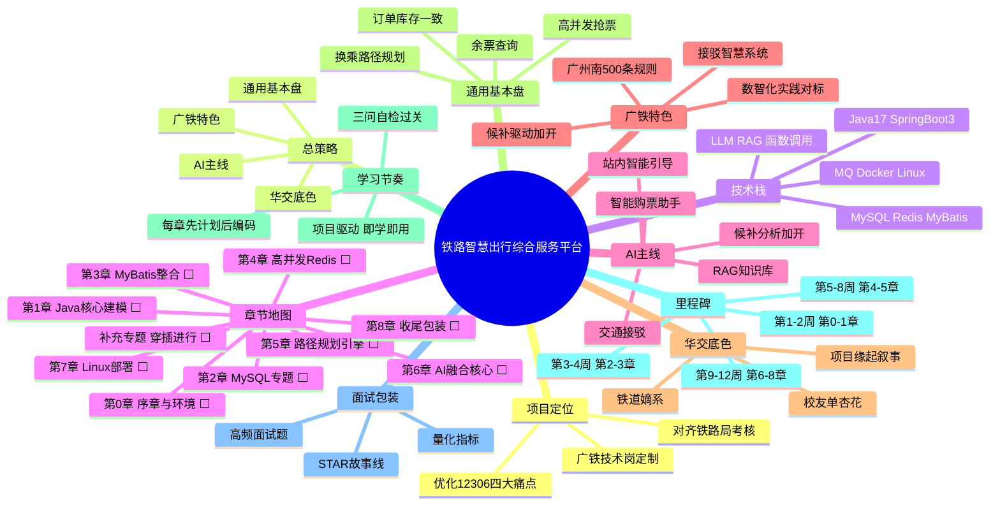

# 总起思维导图 — 铁路智慧出行综合服务平台

> 生成时间：2026-09-14　版本：项目启动初始版
> 用途：一眼看清项目定位、总策略、技术栈、章节地图与全年学习路线。
> 说明：本章节地图为项目启动时的规划状态（⬜），最终完成状态以 `docs/mindmaps/00-progress.md` 为准（第0-8章全部 ✅）。

## 一、Mermaid 思维导图

## 二、Markdown 缩进大纲（备份）

- 铁路智慧出行综合服务平台
  - 项目定位
    - 优化12306四大痛点
    - 对齐铁路局考核
    - 广铁技术岗定制
  - 总策略
    - AI主线
    - 华交底色
    - 广铁特色
    - 通用基本盘
  - 技术栈
    - Java17 SpringBoot3
    - MySQL Redis MyBatis
    - LLM RAG 函数调用
    - MQ Docker Linux
  - 章节地图
    - 第0章 序章与环境 ⬜
    - 第1章 Java核心建模 ⬜
    - 第2章 MySQL专题 ⬜
    - 第3章 MyBatis整合 ⬜
    - 第4章 高并发Redis ⬜
    - 第5章 路径规划引擎 ⬜
    - 第6章 AI融合核心 ⬜
    - 第7章 Linux部署 ⬜
    - 第8章 收尾包装 ⬜
    - 补充专题 穿插进行 ⬜
  - AI主线
    - 智能购票助手
    - 候补分析加开
    - RAG知识库
    - 站内智能引导
    - 交通接驳
  - 广铁特色
    - 广州南500条规则
    - 候补驱动加开
    - 接驳智慧系统
    - 数智化实践对标
  - 华交底色
    - 铁道嫡系
    - 校友单杏花
    - 项目缘起叙事
  - 通用基本盘
    - 余票查询
    - 高并发抢票
    - 换乘路径规划
    - 订单库存一致
  - 学习节奏
    - 项目驱动 即学即用
    - 每章先计划后编码
    - 三问自检过关
  - 里程碑
    - 第1-2周 第0-1章
    - 第3-4周 第2-3章
    - 第5-8周 第4-5章
    - 第9-12周 第6-8章
  - 面试包装
    - STAR故事线
    - 量化指标
    - 高频面试题
