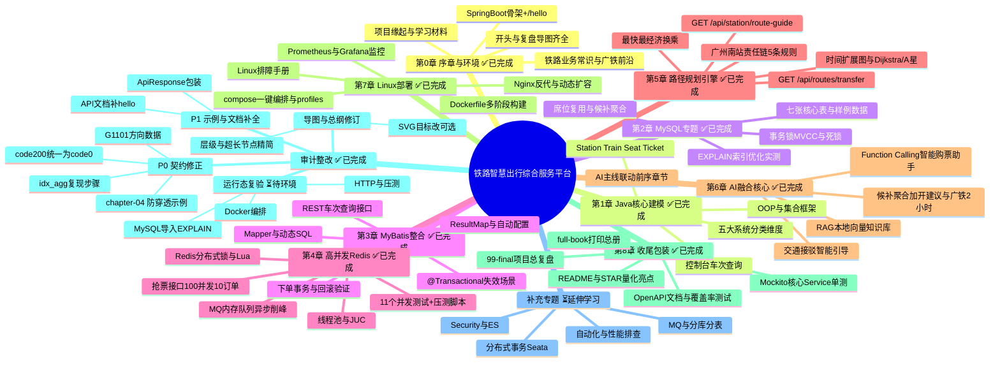

# 总进度导图 — 铁路智慧出行综合服务平台

> 生成时间：2026-09-15　版本：第8章完成 · 全项目收尾（2026-09-15 更新）· 审计整改（2026-09-16）
> 更新规则：每章开始与结束时各更新一次；状态图例：⬜未开始　🔄进行中　✅已完成　⏳延伸学习
> 快照说明：各章 start 导图根节点的 🔄 是"该章开始时"的状态快照，最终状态以本图为准。

## 一、Mermaid 思维导图

## 二、Markdown 缩进大纲（备份）

- 铁路智慧出行综合服务平台
  - 第0章 序章与环境 ✅已完成
    - 铁路业务常识与广铁前沿
    - SpringBoot骨架+/hello
    - 项目缘起与学习材料
    - 开头与复盘导图齐全
  - 第1章 Java核心建模 ✅已完成
    - OOP与集合框架
    - Station Train Seat Ticket
    - 控制台车次查询
    - 五大系统分类维度
  - 第2章 MySQL专题 ✅已完成
    - 七张核心表与样例数据
    - EXPLAIN索引优化实测
    - 事务锁MVCC与死锁
    - 席位复用与候补聚合
  - 第3章 MyBatis整合 ✅已完成
    - Mapper与动态SQL
    - ResultMap与自动配置
    - REST车次查询接口
    - 下单事务与回滚验证
    - @Transactional失效场景
  - 第4章 高并发Redis ✅已完成
    - 线程池与JUC
    - Redis分布式锁与Lua
    - 抢票接口100并发10订单
    - MQ内存队列异步削峰
    - 11个并发测试+压测脚本
  - 第5章 路径规划引擎 ✅已完成
    - 时间扩展图与Dijkstra/A星
    - 最快最经济换乘
    - GET /api/routes/transfer
    - 广州南站责任链5条规则
    - GET /api/station/route-guide
  - 第6章 AI融合核心 ✅已完成
    - Function Calling智能购票助手
    - 候补聚合加开建议与广铁2小时
    - RAG本地向量知识库
    - 交通接驳智能引导
    - AI主线联动前序章节
  - 第7章 Linux部署 ✅已完成
    - Dockerfile多阶段构建
    - compose一键编排与profiles
    - Nginx反代与动态扩容
    - Prometheus与Grafana监控
    - Linux排障手册
  - 第8章 收尾包装 ✅已完成
    - OpenAPI文档与覆盖率测试
    - Mockito核心Service单测
    - README与STAR量化亮点
    - full-book打印总册
    - 99-final项目总复盘
  - 审计整改 ✅已完成
    - P0 契约修正
      - chapter-04 防穿透示例
      - code200统一为code0
      - idx_agg复现步骤
      - G1101方向数据
    - P1 示例与文档补全
      - ApiResponse包装
      - API文档补hello
    - 导图与总纲修订
      - 层级与超长节点精简
      - SVG目标改可选
    - 运行态复验 ⏳待环境
      - MySQL导入EXPLAIN
      - HTTP与压测
      - Docker编排
  - 补充专题 ⏳延伸学习
    - MQ与分库分表
    - 分布式事务Seata
    - Security与ES
    - 自动化与性能排查
