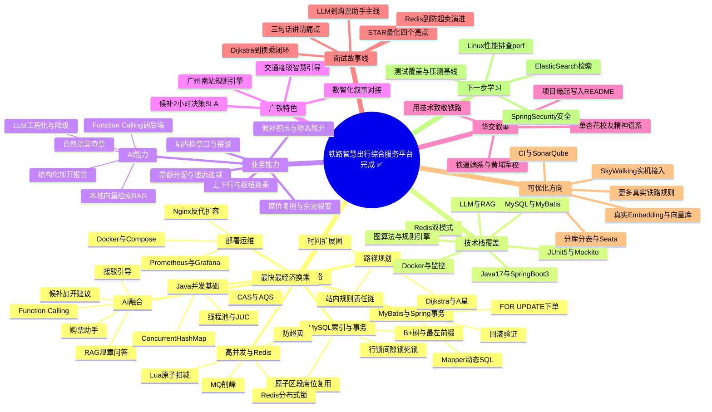

# 项目总复盘导图 — 铁路智慧出行综合服务平台 完成 ✅

> 生成时间：2026-09-15　说明：优先 Mermaid mindmap；下方同时给出 Markdown 缩进大纲备份，供打印版离线内嵌。

## 一、Mermaid 思维导图

## 二、Markdown 缩进大纲（备份）

- 铁路智慧出行综合服务平台 完成 ✅
  - 全项目知识网络
    - MySQL索引与事务
      - B+树与最左前缀
      - 原子区段席位复用
      - 行锁间隙锁死锁
    - 高并发与Redis
      - Redis分布式锁
      - Lua原子扣减
      - 防超卖
      - MQ削峰
    - MyBatis与Spring事务
      - Mapper动态SQL
      - FOR UPDATE下单
      - 回滚验证
    - 路径规划
      - 时间扩展图
      - Dijkstra与A星
      - 最快最经济换乘
      - 站内规则责任链
    - AI融合
      - Function Calling
      - 购票助手
      - 候补加开建议
      - RAG规章问答
      - 接驳引导
    - 部署运维
      - Docker与Compose
      - Nginx反代扩容
      - Prometheus与Grafana
    - Java并发基础
      - 线程池与JUC
      - CAS与AQS
      - ConcurrentHashMap
  - 技术栈覆盖
    - Java17与SpringBoot3
    - MySQL与MyBatis
    - Redis双模式
    - 图算法与规则引擎
    - LLM与RAG
    - Docker与监控
    - JUnit5与Mockito
  - 业务能力
    - 席位复用与余票裂变
    - 票额分配与递远递减
    - 上下行与枢纽换乘
    - 候补积压与动态加开
    - 站内检票口与接驳
  - AI能力
    - LLM工程化与降级
    - Function Calling调后端
    - 本地向量检索RAG
    - 结构化加开报告
    - 自然语言查票
  - 广铁特色
    - 候补2小时决策SLA
    - 广州南站规则引擎
    - 交通接驳智慧引导
    - 数智化叙事对接
  - 华交叙事
    - 铁道嫡系与黄埔军校
    - 单杏花校友精神谱系
    - 项目缘起写入README
    - 用技术致敬铁路
  - 面试故事线
    - 三句话讲清痛点
    - STAR量化四个亮点
    - Redis到防超卖演进
    - Dijkstra到换乘闭环
    - LLM到购票助手主线
  - 可优化方向
    - 分库分表与Seata
    - 真实Embedding与向量库
    - SkyWalking实机接入
    - CI与SonarQube
    - 更多真实铁路规则
  - 下一步学习
    - Linux性能排查perf
    - ElasticSearch检索
    - SpringSecurity安全
    - 测试覆盖与压测基线
